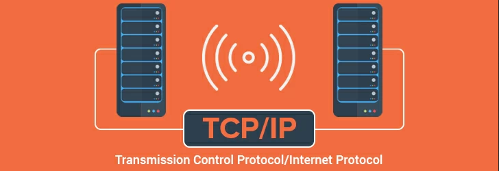
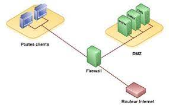
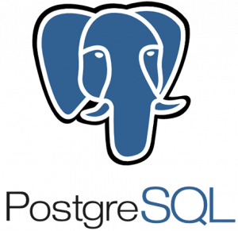

### Zacharie-B
### IT Network student / France

- 📍 [Paris Saclay](https://www.universite-paris-saclay.fr/)
- :technologist: I'm currently working on a [search project](https://github.com/Ghasnae/TER_Files_d_Attente.git)
- :soccer: I'm also a sporty man

## Skills

### Network and security Skills
  

### Software and machine
  

### Others
   
  

## Misc

 
