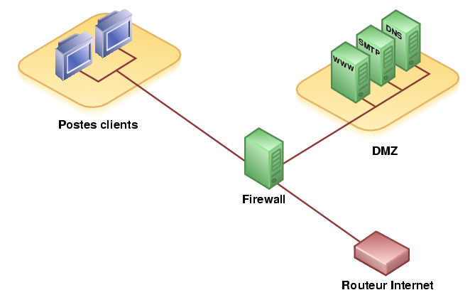

### Zacharie-B
### IT Network student / France

- 📍 [Paris Saclay](https://www.universite-paris-saclay.fr/)
- 🌱 I'm currently working on a [search project](https://github.com/Ghasnae/TER_Files_d_Attente.git)
- � I also a calisthenics man

## Skills

### Network Skills
  

### Software and machine
  

### Web
   

### Other
  

## Misc

 
